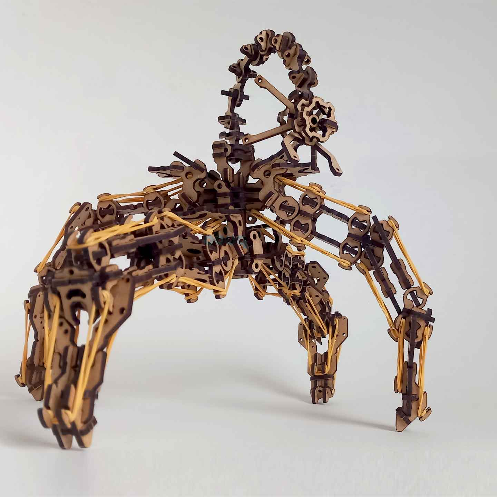

# Optorbis

More information and additional images:  
https://obuqdesign.wordpress.com/2025/02/08/optorbis/

 

## Details

| Property | Value |
|---|---|
| Type | Tridimensional model (261 pieces) |
| Designed for | 3mm mdf or plywood |
| Dimensions | Height: 240mm; Length: 285mm; Width: 285mm |
| Design file format | DXF R14 |
| Units | mm |
| Frame | 130x220mm (x6) – ReadyToCut Layout |
| Scalable | Yes |

 

 

  If you like this design and would like to support my work:
    
  https://buymeacoffee.com/obuq

 

 

#### Thank you to all the patrons that supported me when this design was initially posted on Patreon

 

Roman Kupalov  
patreon person  
Wouter Simons  
Julie Sturgeon  
Todd  
Rudenz Schulz  
Darkly Labs  
Aaron J Radke  
Renzo Ciarma  
Ray

